# 🍧 IceCream 프로젝트

### 1. 프로젝트 기간

- 2024.04.08(월) ~ 2024.05.20(월)

### 2. 팀원 소개

|                       BE (팀장)                        |                           BE                           |                           BE                           |                           FE                           |                           FE                           |                           FE                           |                           AI                           |
| :----------------------------------------------------: | :----------------------------------------------------: | :----------------------------------------------------: | :----------------------------------------------------: | :----------------------------------------------------: | :----------------------------------------------------: | :----------------------------------------------------: |
|                       **이재진**                       |                       **정종길**                       |                       **심상익**                       |                       **유영준**                       |                       **황채원**                       |                       **서준하**                       |                       **김민진**                       |
|  |  |  |  |  |  |  |
|                  Infra   GPU 서버                  |           Security   메시지 큐 구축            |     ELK 스택   관리자page   GPU 서버       |                    FCM   Design                    |               WebSocket   CCTV 구축                |                  GPS   지도 구축                   |            객체 추적   객체 속도               |

# 🔍 프로젝트 소개

### 1. 서비스 요약

- 자녀들의 안전 보행을 통한 스쿨존 내 교통 사고 예방 어플리케이션

### 2. 기획 의도

  - 민식이법 시행 후에도 스쿨존 내 교통사고 건수가 꾸준히 증가하고 있음. 이는 운전자의 노력만으로는 사고를 완벽히 예방하기 어렵다는 것을 의미함. **따라서 아래 2가지 방법으로 보행자(자녀)에게도 주의를 주어 스쿨존 내 교통사고를 예방하고자 함**
    
    - **위험 인지 향상을 통한 예방:** 과속 차량 출몰 시 인근 어린이 보행자에게 위험 알림을 주어 교통 사고를 사전에 방지
    - **올바른 횡단보도 사용 유도 :** 어린이 보행자들이 횡단보도를 올바르게 이용하도록 유도함으로써 교통 사고 발생률 감소

    

# 💬 주요 기능

### **1. 과속 차량에 대한 위험 알림**

- **과속 차량 탐지** 

     - 실시간으로 찍은 CCTV 영상을 GPU 서버로 보냄
     - GPU 서버에서 YOLOv9를 통해서, 차량 객체 감지와 차량의 속도를 파악
     - 과속 차량 발생 시 cctv_name과 매핑된 횡단보도 조회 (cctv 근처에 위치한 횡단보도 조회) 
     - 과속 차량 인근 횡단보도 영역에 위치한 자녀에게 FCM을 통해 위험 알림 전송 (모바일 및 스마트 워치 알림)

- **과속 위험 알림 대상자 판별**
  
  - 모바일 GPS 데이터를 수집하여 보행자가 특정 횡단보도 영역에 위치하는지 판별(공간 인덱싱 사용)
  - 특정 횡단보도에 위치하는 경우 Redis에 기록

### **2. 자녀 목적지 도착 시, 부모 어플에 알림 전송**

   - 자녀의 앱 활성화 시간 및 목적지 지정
   - 앱 활성화 시간동안 자녀 휴대폰에서 GPS 데이터 전송(1번/초)
   - 자녀 목적지 도착 시(공간 인덱싱 사용) 부모에게 알림 전송
   - 부모는 자녀의 앱 활성화 시간동안 자녀의 실시간 위치 조회 가능

### **3. 자녀 무단 횡단 시, 부모 / 자녀에게 알림 전송**

   - 무단 횡단 영역을 PostgresSQL에 저장 (4326좌표계를 기준)
   - GPS 데이터를 수집하여 자녀가 무단 횡단 영역에 위치하는지 파악(공간 인덱싱 사용)
   - 자녀가 무단 횡단영역에 위치 하였을 때 부모 및 자녀에게 무단횡단 알림 발송

### 4. 자녀 안전 보행 목표 설정

- 부모의 어플리케이션에서 등록된 자녀의 안전 보행 목표(ex. 15일)와 리워드를 설정(ex. 용돈 1,000 원)
- 안전 보행 목표는 설정한 기간 만큼 연속해서 무단 횡단을 하지 않았을 경우 달성
- 무단 횡단 발생 시 목표 달성 현황 0일로 초기화
- 설정한 목표 달성 시 부모, 자녀 알림 전송
- 목표 달성에 대한 리워드는 부모와 자녀간 협의

### 5. 관리자 페이지를 통한 CCTV 분석 결과 모니터링

- GPU 서버에서 CCTV 영상 처리 결과를 실시간으로 관리자 페이지에 전송
  
  - 차량 객체에 속도를 박스 형태로 마킹한 이미지를 관리자 페이지로 전송  
  - 과속 차량 탐지 시 발생 시간과 속도 정보도 관리자 페이지로 전송
- 관리자 페이지에서 실시간으로 CCTV 영상 처리 결과와 과속 정보를 출력

# 📱 서비스 화면

|                         앱 진입 화면                         |
| :----------------------------------------------------------: |
| 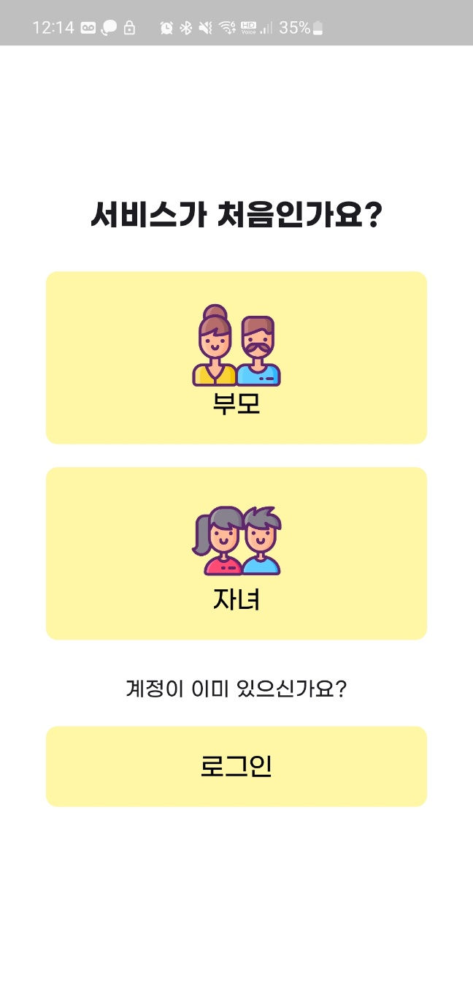 |
|              부모 / 자녀를 선택하여 서비스 이용              |

|       부모 회원가입       |        자녀 QR 생성         |      자녀 QR 등록      |
| :-------------------: | :---------------------------: | :------------------------: |
|    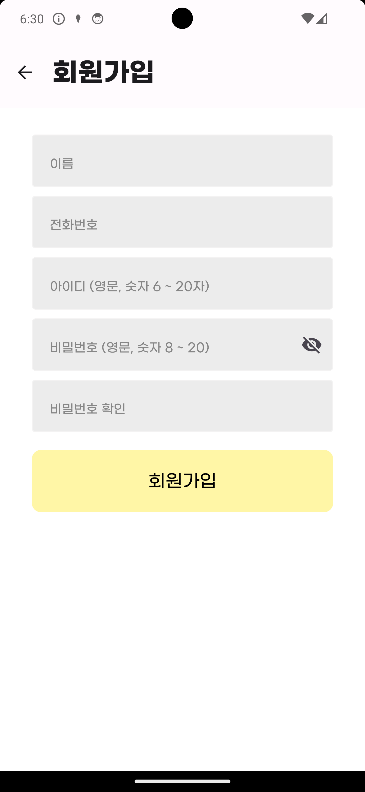     |        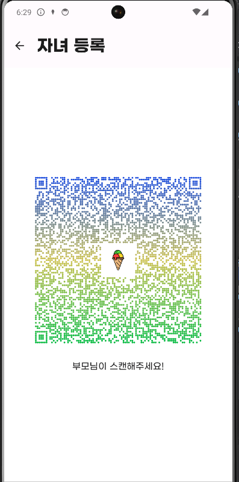         |      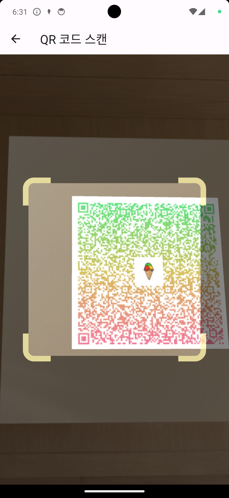        |
| 부모 회원가입 화면 | 자녀 정보(디바이스 ID, FCM 토큰 등)가 담긴 QR 생성 | 부모 기기에서 자녀의 QR 등록으로 자녀 회원가입  |

|     부모 메인 화면      |      자녀 마커 클릭 시       |
| :---------------------: | :--------------------------: |
|     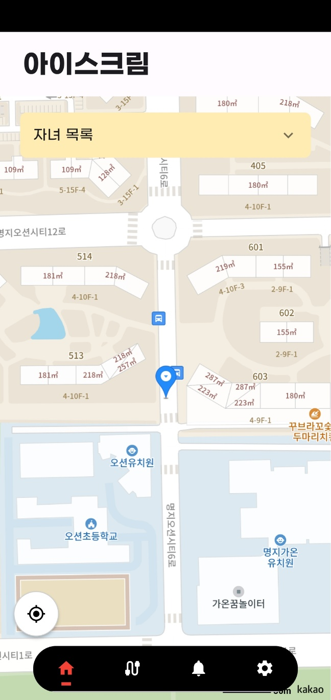      |       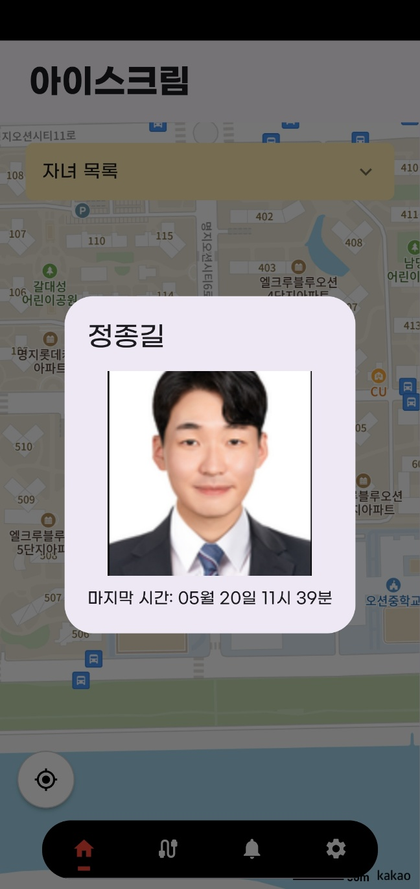         |
| 자신과 자녀의 위치 확인 | 자녀의 정보와 위치 확인 가능 |

|                         안전 지킴이                          |                         리워드 관리                          |
| :----------------------------------------------------------: | :----------------------------------------------------------: |
| 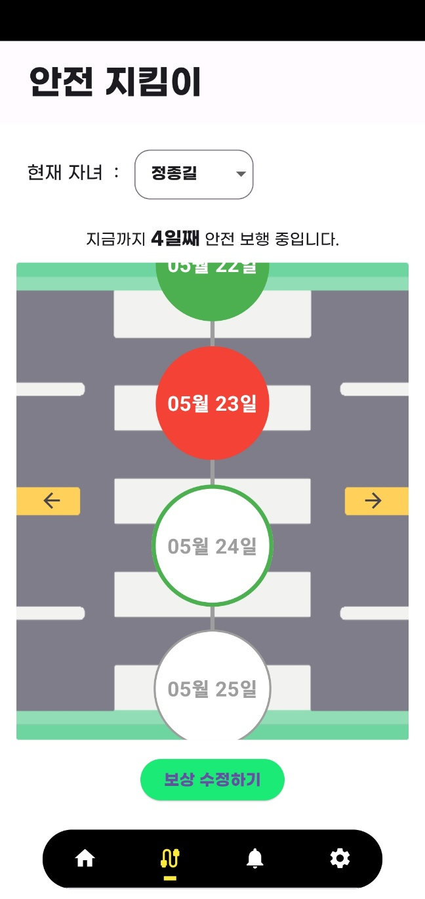 | 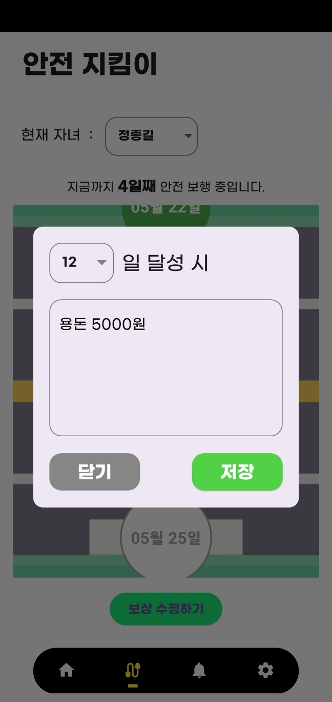 |
|                  자녀의 무단횡단 정보 확인                   |     자녀의 횡단보도 사용에 대한   리워드 등록 및 수정     |

|    알림 내역 확인     |
| :-------------------: |
|    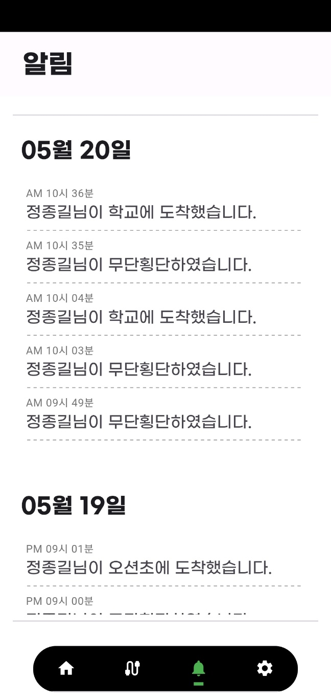     |
| 일자별 알림 내역 확인 |

|       자녀 목록       |        자녀 상세 정보         |      자녀 목적지 관리      |
| :-------------------: | :---------------------------: | :------------------------: |
|    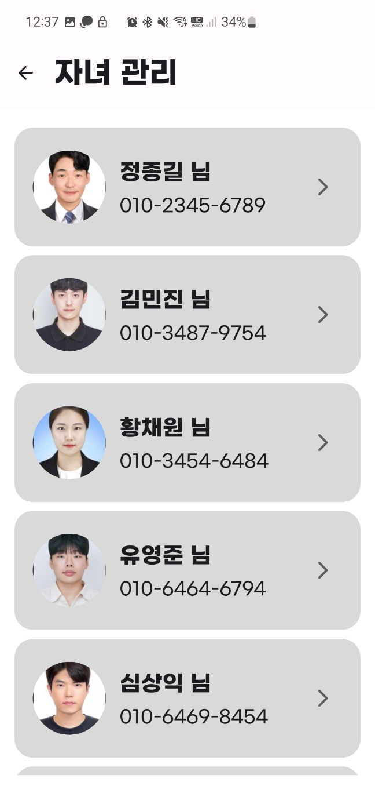     |        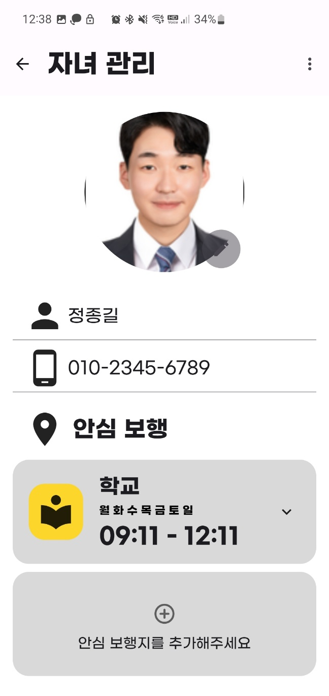         |      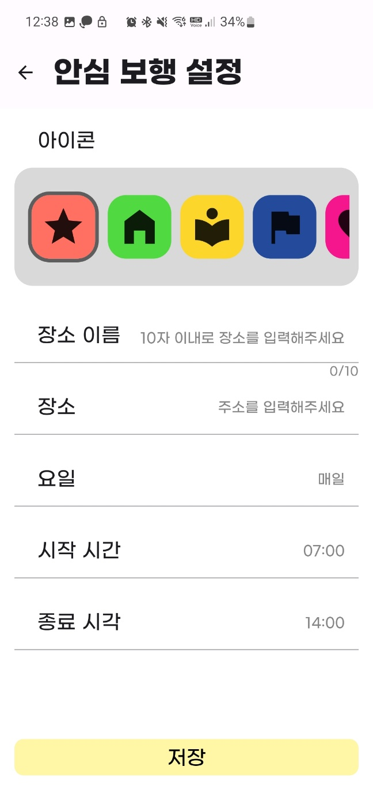        |
| 등록된 자녀 목록 확인 | 자녀의 상세 정보 조회 및 수정 | 자녀의 목적지 등록 및 수정 |

|    관리자 페이지     |
| :-------------------: |
|         |
| AI를 활용해 CCTV를 통한 차량의 속도 측정   과속 발생 시 사용자에게 위험 알림 전송  |

|                       과속 알림 화면                       |
| :------------------------------------------------------: |
|                     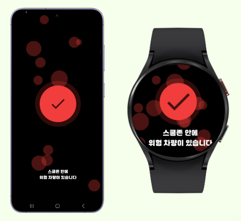                      |
| 과속 발생 시, 스마트폰 및 스마트워치에 위험 알림 전송 |

## 👩‍💻 기술 스택 및 개발 환경

### 1. Frontend
    

### 2. Backend

   

   

### 3. DB

   

### 4. AI 
    

### 5. Infra

      

### 6. Collaboration

   

# 🏢 설계
### 1. 아키텍처 설계

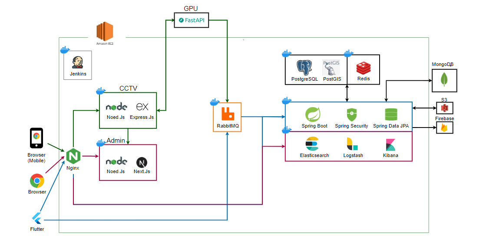

### 2. DB 설계 (ERD)

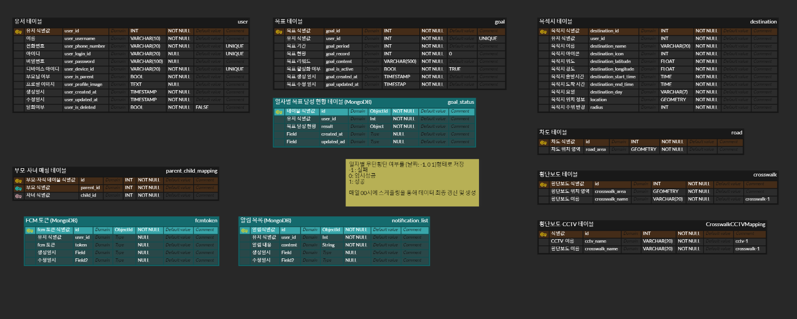

## 📑 프로젝트 산출물
- [요구사항-기능 명세서](https://swamp-shaker-ff8.notion.site/39e2fa39bcd443a089e8906058a0056b?v=fa6777d377164e7dbbc40f70032615a7)
- [API 명세서](https://swamp-shaker-ff8.notion.site/API-1582f6714d75481c9570fe2654d21666)  
- [와이어프레임](https://www.figma.com/design/YQuvNP8ix8z96yOsAmGpBU/%EC%95%84%EC%9D%B4%EC%8A%A4%ED%81%AC%EB%A6%BC?node-id=67-690&t=xTt8Ec62LzmAH2Q3-1)
- [포팅메뉴얼](./exec/PortingManual.md)
- [UCC](./docs/UCC.mp4)
- [시연영상](./docs/시연영상.mp4)
